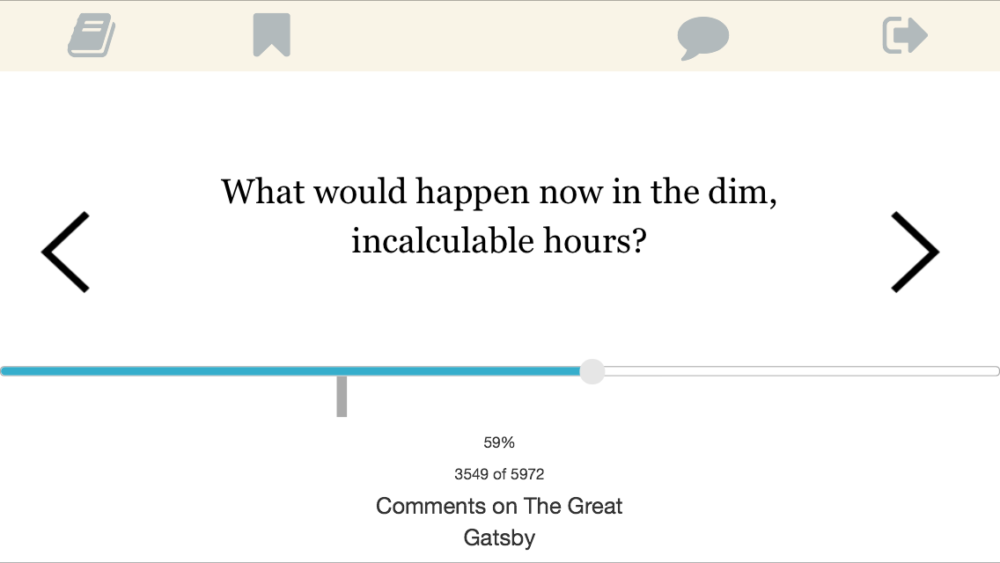

#ReadyReader

ReadyReader is a mobile reading platform intended for on-the-go readers who utilize their modile devices as their primary means of reading. The live web application can be found <a href="http://ready-reader.herokuapp.com/" target="_blank"> here </a>.

Primary contributors are as follows:

- [Ben Brostoff](https://github.com/BenBrostoff)
- [Greg Knudsen](https://github.com/greg99799)
- [Brendan Susens-Jackson](https://github.com/bsusensjackson/)

This project was built using the Ruby on the Rails framework and additionally followed a JavaScript MVC pattern on the client side. We prioritized responsive design in building ReadyReader, as the impetus for the project in part was using mobile devices for long commutes. We attempted to use a Test Driven Development oriented approach throughout this project, and made use of [RSpec](http://rspec.info/), [Capybara](https://github.com/jnicklas/capybara) and [SimpleCov]
(https://github.com/colszowka/simplecov) to achieve this purpose.

#Screenshot


#Usage / Contribute

To run ReadyReader locally and/or to test out changes in preparation for a contribution, you will need to have Rails, Postgres and Redis installed. Assuming you have met these dependencies:

```
bundle install 

rake db:create
rake db:migrate
rake db:seed
```
For book uploads, the application uses Redis and Resque, and you'll have to run the server prior to initiating the Rais server:

```
redis-server
```

Next, queue the relevant job using a custom rake task in a new terminal tab:


```
rake resque:work QUEUE=sentences
```

Now you're ready to rock-and-roll:

```
rails s thin
```

#Thank You

We owe a great debt to our Dev Bootcamp instructor [Matt Bunday](http://zencephalon.com), without whom this project would not have been possible. Matt came up with the original idea for ReadyReader and trusted us to execute on his vision.

We are further in debt to our Phase 3 lead Dev Bootcamp instructor, [Rebecca Miller-Webster](http://www.rebeccamiller-webster.com/). Rebecca provided frequent consulting on this project and devoted significant time to guiding us through the issues we encountered on the road to deployment.

Rebecca and Matt - thank you.

We welcome pull requests, questions and comments.
